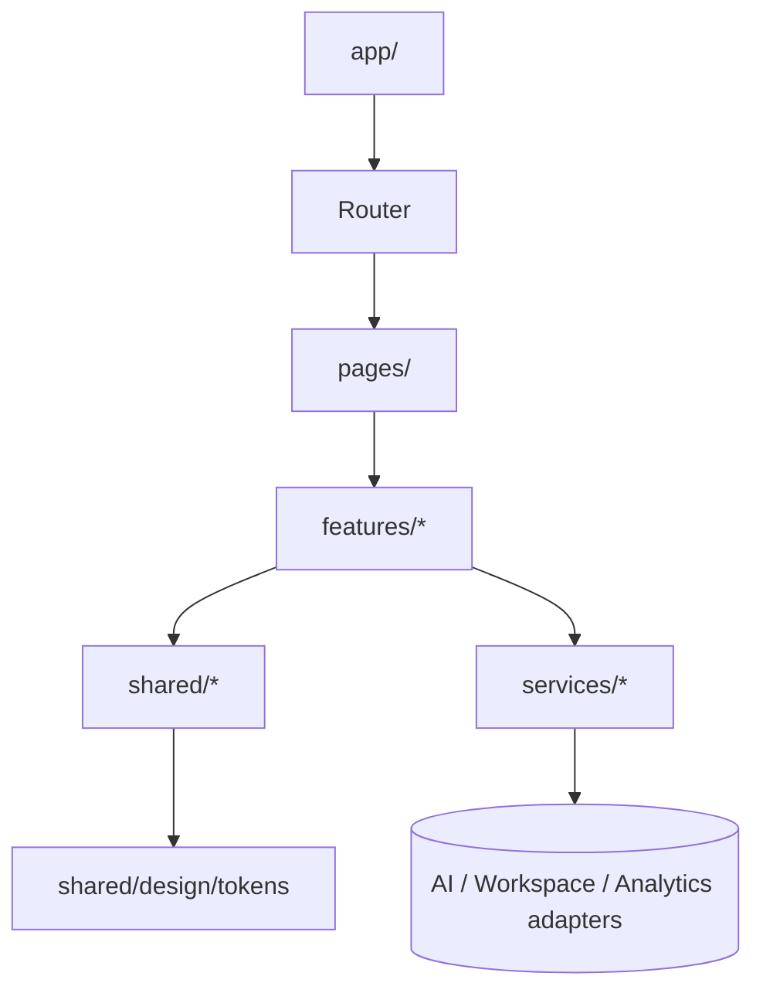

# Architecture

## Layers

```
pages/        Route entry points; no business logic
features/     Self-contained product modules (search, draft, …)
shared/       UI primitives, hooks, design tokens, contracts, utils
services/     Side-effect boundaries (ai, workspace, analytics)
app/          Providers, router, error boundary, theme
```

**Rule:** dependencies flow **downward only**. `features/*` never imports from another `features/*`.

## Composition Diagram



## Key Modules

- `services/ai/` — `AIService` interface + `mock`, future `openai`, `azure` adapters.
- `services/workspace/` — `WorkspaceRepository` interface + IndexedDB impl.
- `shared/ui/Motion.tsx` — Framer Motion wrapper honoring `prefers-reduced-motion`.
- `shared/ui/SafeHTML.tsx` — only sanctioned `dangerouslySetInnerHTML` site.
- `shared/contracts/` — zod schemas + TS types shared by UI and services.

## Routing (initial)

`/`, `/search`, `/compare`, `/draft`, `/case`, `/theory`, `/creator`, `/internships`, `/maps`, `/workspace`, `/analytics`.

## State

- Local UI state: `useState` / `useReducer`.
- Cross-route AI state: Zustand store per feature, namespaced.
- Server cache (when backend lands): React Query.

## Theming

Light canonical (paper-white + editorial blue). Tokens drive Tailwind via CSS variables (RGB triplets, consumed as `rgb(var(--token) / <alpha>)`). Token names retained from the original dark palette so utilities like `bg-bg-obsidian` and `text-ink-primary` continue to compose; only the underlying values are inverted. No dark theme in v1.
